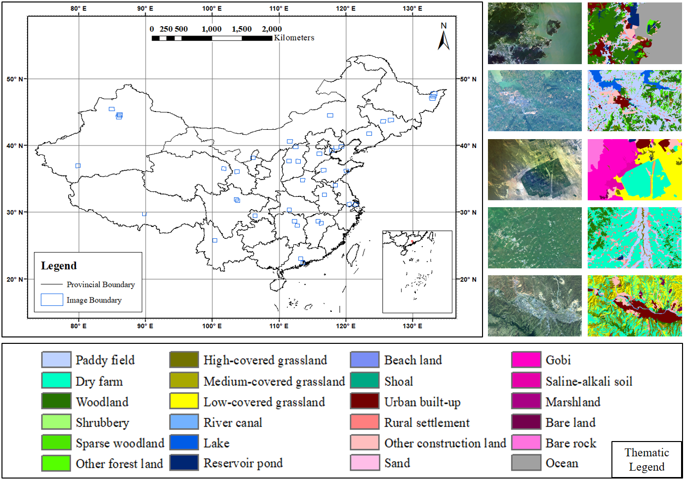
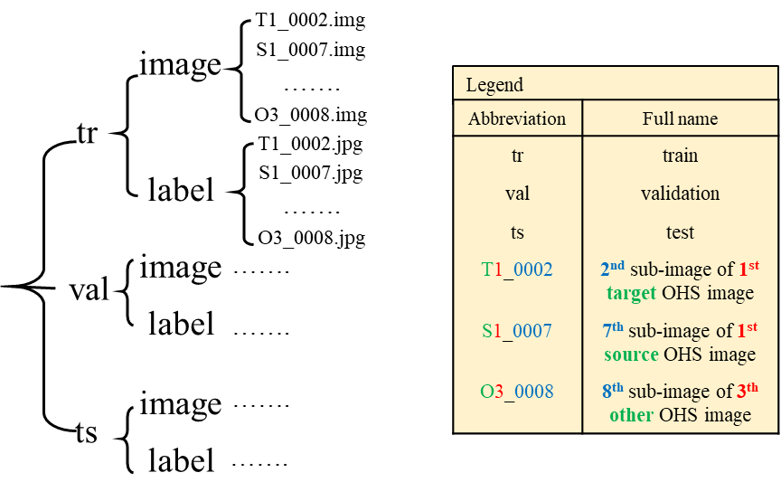

# WHU-OHS-Pytorch

**Paper:** 
J. Li, X. Huang, and L. Tu, “WHU-OHS : A benchmark dataset for large-scale Hersepctral Image classification,” Int. J. Appl. Earth Obs. Geoinf., vol. 113, no. September, p. 103022, 2022, doi: 10.1016/j.jag.2022.103022. [[Link]](https://www.sciencedirect.com/science/article/pii/S1569843222002102)

**Dataset download:** http://irsip.whu.edu.cn/resources/WHU_OHS_show.php

## Dateset Introduction
The WHU-OHS dataset is made up of 42 OHS satellite images acquired from more than 40 different locations in China (Fig. 1). The imagery has a spatial resolution of 10 m (nadir) and a swath width of 60 km (nadir). There are 32 spectral channels ranging from the visible to near-infrared range, with an average spectral resolution of 15 nm. We cropped each image into 512 × 512 pixels with a stride of 32. There are 4822, 513, and 2460 sub-images in the training, validation, and test sets, respectively.

Fig. 1. Left: The geographical locations of the 42 images in the WHU-OHS dataset. Right: Examples of local OHS parcels (true-color compositions with R: 670 nm; G: 566 nm; B: 480 nm) and their corresponding reference labels.

## Dataset Format
The dataset was organized in the format shown in Fig. 2.

Fig. 2. Data organization of the WHU-OHS dataset.

## Code
Pytorch toolbox for large-scale hyperspectral image classification using WHU-OHS dataset. The deep network models will be updated continuously.

Deep network models:

**1D-CNN**: W. Hu, Y. Huang, L. Wei, F. Zhang, and H. Li, “Deep Convolutional Neural Networks for Hyperspectral Image Classification,” J. Sensors, vol. 2015, p. 12, 2015.

**3D-CNN**: Y. Chen, H. Jiang, C. Li, X. Jia, and P. Ghamisi, “Deep Feature Extraction and Classification of Hyperspectral Images Based on Convolutional Neural Networks,” IEEE Trans. Geosci. Remote Sens., vol. 54, pp. 6232–6251, 2016.

**A2S2K-ResNet**: S. K. Roy, S. Manna, T. Song, and L. Bruzzone, “Attention-Based Adaptive Spectral–Spatial Kernel ResNet for Hyperspectral Image Classification,” IEEE Trans. Geosci. Remote Sens., vol. 59, no. 9, pp. 7831–7843, 2021.

**FreeNet**: Z. Zheng, Y. Zhong, A. Ma, and L. Zhang, “FPGA: Fast Patch-Free Global Learning Framework for Fully End-to-End Hyperspectral Image Classification,” IEEE Trans. Geosci. Remote Sens., vol. 58, no. 8, pp. 5612–5626, 2020.

Accuracy on test set for reference (taking S1: Changchun as an example):

<table class="MsoTableGrid" border="1" cellspacing="0" cellpadding="0" style="border-collapse:collapse;border:none;mso-border-alt:solid windowtext .5pt;
 mso-yfti-tbllook:1184;mso-padding-alt:0cm 5.4pt 0cm 5.4pt">
 <tbody><tr style="mso-yfti-irow:0;mso-yfti-firstrow:yes">
  <td width="111" valign="top" style="width:83.0pt;border:solid windowtext 1.0pt;
  mso-border-alt:solid windowtext .5pt;padding:0cm 5.4pt 0cm 5.4pt">
  
<b style="mso-bidi-font-weight:normal">Network<o:p></o:p></b>

  </td>
  <td width="111" valign="top" style="width:82.95pt;border:solid windowtext 1.0pt;
  border-left:none;mso-border-left-alt:solid windowtext .5pt;mso-border-alt:
  solid windowtext .5pt;padding:0cm 5.4pt 0cm 5.4pt">
  
1D-CNN

  </td>
  <td width="111" valign="top" style="width:82.95pt;border:solid windowtext 1.0pt;
  border-left:none;mso-border-left-alt:solid windowtext .5pt;mso-border-alt:
  solid windowtext .5pt;padding:0cm 5.4pt 0cm 5.4pt">
  
3D-CNN

  </td>
  <td width="111" valign="top" style="width:82.95pt;border:solid windowtext 1.0pt;
  border-left:none;mso-border-left-alt:solid windowtext .5pt;mso-border-alt:
  solid windowtext .5pt;padding:0cm 5.4pt 0cm 5.4pt">
  
A2S2K-ResNet

  </td>
  <td width="111" valign="top" style="width:82.95pt;border:solid windowtext 1.0pt;
  border-left:none;mso-border-left-alt:solid windowtext .5pt;mso-border-alt:
  solid windowtext .5pt;padding:0cm 5.4pt 0cm 5.4pt">
  
FreeNet

  </td>
 </tr>
 <tr style="mso-yfti-irow:1">
  <td width="111" valign="top" style="width:83.0pt;border:solid windowtext 1.0pt;
  border-top:none;mso-border-top-alt:solid windowtext .5pt;mso-border-alt:solid windowtext .5pt;
  padding:0cm 5.4pt 0cm 5.4pt">
  
<b style="mso-bidi-font-weight:normal">OA<o:p></o:p></b>

  </td>
  <td width="111" valign="top" style="width:82.95pt;border-top:none;border-left:
  none;border-bottom:solid windowtext 1.0pt;border-right:solid windowtext 1.0pt;
  mso-border-top-alt:solid windowtext .5pt;mso-border-left-alt:solid windowtext .5pt;
  mso-border-alt:solid windowtext .5pt;padding:0cm 5.4pt 0cm 5.4pt">
  
0.636

  </td>
  <td width="111" valign="top" style="width:82.95pt;border-top:none;border-left:
  none;border-bottom:solid windowtext 1.0pt;border-right:solid windowtext 1.0pt;
  mso-border-top-alt:solid windowtext .5pt;mso-border-left-alt:solid windowtext .5pt;
  mso-border-alt:solid windowtext .5pt;padding:0cm 5.4pt 0cm 5.4pt">
  
0.766

  </td>
  <td width="111" valign="top" style="width:82.95pt;border-top:none;border-left:
  none;border-bottom:solid windowtext 1.0pt;border-right:solid windowtext 1.0pt;
  mso-border-top-alt:solid windowtext .5pt;mso-border-left-alt:solid windowtext .5pt;
  mso-border-alt:solid windowtext .5pt;padding:0cm 5.4pt 0cm 5.4pt">
  
0.809

  </td>
  <td width="111" valign="top" style="width:82.95pt;border-top:none;border-left:
  none;border-bottom:solid windowtext 1.0pt;border-right:solid windowtext 1.0pt;
  mso-border-top-alt:solid windowtext .5pt;mso-border-left-alt:solid windowtext .5pt;
  mso-border-alt:solid windowtext .5pt;padding:0cm 5.4pt 0cm 5.4pt">
  
0.847

  </td>
 </tr>
 <tr style="mso-yfti-irow:2">
  <td width="111" valign="top" style="width:83.0pt;border:solid windowtext 1.0pt;
  border-top:none;mso-border-top-alt:solid windowtext .5pt;mso-border-alt:solid windowtext .5pt;
  padding:0cm 5.4pt 0cm 5.4pt">
  
<b style="mso-bidi-font-weight:normal">Kappa<o:p></o:p></b>

  </td>
  <td width="111" valign="top" style="width:82.95pt;border-top:none;border-left:
  none;border-bottom:solid windowtext 1.0pt;border-right:solid windowtext 1.0pt;
  mso-border-top-alt:solid windowtext .5pt;mso-border-left-alt:solid windowtext .5pt;
  mso-border-alt:solid windowtext .5pt;padding:0cm 5.4pt 0cm 5.4pt">
  
0.526

  </td>
  <td width="111" valign="top" style="width:82.95pt;border-top:none;border-left:
  none;border-bottom:solid windowtext 1.0pt;border-right:solid windowtext 1.0pt;
  mso-border-top-alt:solid windowtext .5pt;mso-border-left-alt:solid windowtext .5pt;
  mso-border-alt:solid windowtext .5pt;padding:0cm 5.4pt 0cm 5.4pt">
  
0.700

  </td>
  <td width="111" valign="top" style="width:82.95pt;border-top:none;border-left:
  none;border-bottom:solid windowtext 1.0pt;border-right:solid windowtext 1.0pt;
  mso-border-top-alt:solid windowtext .5pt;mso-border-left-alt:solid windowtext .5pt;
  mso-border-alt:solid windowtext .5pt;padding:0cm 5.4pt 0cm 5.4pt">
  
0.757

  </td>
  <td width="111" valign="top" style="width:82.95pt;border-top:none;border-left:
  none;border-bottom:solid windowtext 1.0pt;border-right:solid windowtext 1.0pt;
  mso-border-top-alt:solid windowtext .5pt;mso-border-left-alt:solid windowtext .5pt;
  mso-border-alt:solid windowtext .5pt;padding:0cm 5.4pt 0cm 5.4pt">
  
0.806

  </td>
 </tr>
 <tr style="mso-yfti-irow:3;mso-yfti-lastrow:yes">
  <td width="111" valign="top" style="width:83.0pt;border:solid windowtext 1.0pt;
  border-top:none;mso-border-top-alt:solid windowtext .5pt;mso-border-alt:solid windowtext .5pt;
  padding:0cm 5.4pt 0cm 5.4pt">
  
<b style="mso-bidi-font-weight:normal">mIoU<o:p></o:p></b>

  </td>
  <td width="111" valign="top" style="width:82.95pt;border-top:none;border-left:
  none;border-bottom:solid windowtext 1.0pt;border-right:solid windowtext 1.0pt;
  mso-border-top-alt:solid windowtext .5pt;mso-border-left-alt:solid windowtext .5pt;
  mso-border-alt:solid windowtext .5pt;padding:0cm 5.4pt 0cm 5.4pt">
  
0.227

  </td>
  <td width="111" valign="top" style="width:82.95pt;border-top:none;border-left:
  none;border-bottom:solid windowtext 1.0pt;border-right:solid windowtext 1.0pt;
  mso-border-top-alt:solid windowtext .5pt;mso-border-left-alt:solid windowtext .5pt;
  mso-border-alt:solid windowtext .5pt;padding:0cm 5.4pt 0cm 5.4pt">
  
0.305

  </td>
  <td width="111" valign="top" style="width:82.95pt;border-top:none;border-left:
  none;border-bottom:solid windowtext 1.0pt;border-right:solid windowtext 1.0pt;
  mso-border-top-alt:solid windowtext .5pt;mso-border-left-alt:solid windowtext .5pt;
  mso-border-alt:solid windowtext .5pt;padding:0cm 5.4pt 0cm 5.4pt">
  
0.419

  </td>
  <td width="111" valign="top" style="width:82.95pt;border-top:none;border-left:
  none;border-bottom:solid windowtext 1.0pt;border-right:solid windowtext 1.0pt;
  mso-border-top-alt:solid windowtext .5pt;mso-border-left-alt:solid windowtext .5pt;
  mso-border-alt:solid windowtext .5pt;padding:0cm 5.4pt 0cm 5.4pt">
  
0.480

  </td>
 </tr>
</tbody></table>

